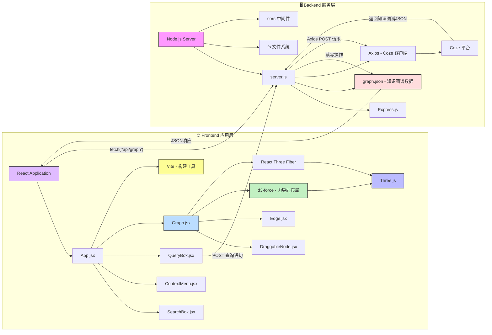

# 知识图谱 (Interactive Knowledge Graph)

[](https://react.dev/) [](https://threejs.org/) [](https://expressjs.com/) [](https://vitejs.dev/)

这是一个使用 **React** 和 **Three.js** 构建的、由 **AI 驱动**的交互式3D知识图谱可视化应用。用户不仅可以浏览和操作图谱，还可以通过自然语言查询，利用AI动态生成新的知识图谱。

---

## ✨ 核心功能

*   **🤖 AI驱动的图谱生成**: 输入一个主题（例如“学习机器学习”），应用将通过后端连接的 [Coze AI](https://www.coze.cn/) 服务，自动生成结构化的知识图谱数据并进行可视化。
*   **🎨 动态3D可视化**: 使用 `@react-three/fiber` 和 `@react-three/drei` 在浏览器中渲染可交互的3D节点和边。
*   **🔬 智能布局算法**:
    *   **分层布局**: 根据数据中的 `layer` 属性，将节点在Z轴上进行分层排列。
    *   **力导向布局**: 在每个层内，使用自定义的力导向算法 (`d3-force` 思想) 模拟节点间的斥力和边的引力，实现自然、美观的布局。
*   **🖱️ 丰富的交互体验**:
    *   **节点拖拽**: 用户可以自由拖动节点，拖拽结束后图谱会重新进行力导向微调。
    *   **镜头控制**: 使用 `OrbitControls` 可以轻松缩放、平移和旋转视角。
    *   **上下文菜单**: 右键点击节点，可以进行**增、删、改**等操作。
    *   **节点搜索与聚焦**: 在搜索框中输入节点名称，可以快速定位到图谱中的节点，并移动镜头聚焦。
*   **🔗 动态节点/边样式**: 节点的大小和边的粗细会根据其**度**（连接数）动态变化，直观展示节点在图谱中的重要性。
*   **🚀 前后端分离架构**:
    *   **前端**: 使用 Vite + React 构建，响应迅速。
    *   **后端**: 使用 Node.js + Express 提供API服务，负责数据持久化和与AI服务通信。

## ⚠️ 注意事项

*   **AI数据不确定性**: 由于AI返回的数据具有不确定性，偶尔可能会生成无法被前端正确解析的图谱结构。如果遇到图谱未更新或显示异常，请尝试**重新发送查询**，通常多尝试几次即可解决。

## 🏗️ 项目架构

项目采用前后端分离的模式，职责清晰。



1.  **前端 (`/client`)**:
    *   使用 `Vite` 作为构建工具，`React` 作为UI框架。
    *   `@react-three/fiber` 作为 `Three.js` 的React渲染器，将React组件映射为3D对象。
    *   `App.jsx` 是主应用组件，管理全局状态和各大功能组件。
    *   `Graph.jsx` 负责核心的图谱渲染和布局计算。
    *   各个组件 (`QueryBox`, `SearchBox`, `ContextMenu`, `DraggableNode`) 负责具体的用户交互。

2.  **后端 (`/server`)**:
    *   一个轻量级的 `Express.js` 服务器。
    *   提供RESTful API：
        *   `GET /api/graph`: 读取并返回 `server/data/graph.json` 中的图谱数据。
        *   `POST /api/update-graph`: 接收前端传来的图谱数据，并更新 `graph.json` 文件。
        *   `POST /api/coze/graph`: 接收前端的自然语言查询，构造特定的Prompt，请求Coze AI服务，并将返回的JSON数据透传给前端。

## 🛠️ 技术栈

| 类别 | 技术 | 描述 |
| :--- | :--- | :--- |
| **前端** | [React](https://react.dev/) | 构建用户界面的核心框架。 |
| | [Three.js](https://threejs.org/) | 强大的3D图形库。 |
| | [@react-three/fiber](https://docs.pmnd.rs/react-three-fiber/getting-started/introduction) | Three.js的React渲染器，让3D开发声明化。 |
| | [@react-three/drei](https://github.com/pmndrs/drei) | `fiber`的实用工具集，如`OrbitControls`。 |
| | [Vite](https://vitejs.dev/) | 下一代前端开发与构建工具。 |
| | [axios](https://axios-http.com/) | 用于与后端API进行通信。 |
| **后端** | [Node.js](https://nodejs.org/) | JavaScript运行时环境。 |
| | [Express](https://expressjs.com/) | 简洁而灵活的Node.js Web应用框架。 |
| | [CORS](https://expressjs.com/en/resources/middleware/cors.html) | 处理跨域资源共享。 |
| **开发工具**| [Concurrent.ly](https://github.com/open-cli-tools/concurrently) | 同时运行多个命令，方便同时启动前后端。 |

## 🚀 如何开始

### 1. 环境准备

*   确保你的开发环境中已经安装了 [Node.js](https://nodejs.org/) (建议使用 v18 或更高版本)。
*   拥有一个 [Coze](https://www.coze.cn/) 账号，并创建了一个能理解指令并返回JSON的Bot。

### 2. 安装依赖

克隆项目到本地，然后在项目根目录下运行以下命令来安装所有依赖：

```bash
npm install
```

### 3. 环境配置

为了使AI生成功能正常工作，你需要在后端配置你的Coze Bot信息。
在项目根目录下名新建`.env`文件
```dotenv
COZE_TOKEN='pat_xxxxxxxx'; // 你的Coze API Token
BOT_ID='xxxxxxxxxxxx';   // 你的Bot ID
```

### 4. 运行项目

安装完依赖并配置好后，使用以下命令可以同时启动前端开发服务器和后端服务：

```bash
npm run start-all
```

*   前端应用将运行在 `http://localhost:5173` (或Vite指定的其他端口)。
*   后端服务将运行在 `http://localhost:3001`。

现在，你可以在浏览器中打开前端地址，开始探索这个知识图谱应用了！

## 🐳 使用 Docker 运行

如果你安装了 Docker，可以更方便地一键启动整个应用。

### 1. 环境准备

*   确保你的机器上已经安装了 [Docker](https://www.docker.com/) 和 [Docker Compose](https://docs.docker.com/compose/install/)。
*   按照上面的“环境配置”部分，在项目根目录创建好 `.env` 文件，因为 Docker Compose 会将它自动注入后端服务。

### 2. 构建并启动服务

在项目根目录下，运行以下命令：

```bash
docker compose up --build
```

*   Docker Compose 会自动构建前端和后端的镜像，并启动两个容器。
*   前端应用将运行在 `http://localhost:5173`。
*   后端服务将运行在 `http://localhost:3001`。
*   如果是中文路径就显示指定名称`docker compose -p zhishitupu up --build`防止解析错误。

### 3. 停止服务

要停止所有正在运行的容器，可以在项目根目录下按 `Ctrl + C`，或者在另一个终端中运行：

```bash
docker-compose down
```

## 📜 可用脚本

在 `package.json` 中定义了以下脚本：

*   `npm run dev`: 仅启动前端Vite开发服务器。
*   `npm run build`: 构建用于生产环境的前端应用。
*   `npm run preview`: 在本地预览生产环境构建的应用。
*   `npm run start-server`: 仅启动后端Node.js服务器。
*   `npm run start-all`: **(推荐)** 使用 `concurrently` 同时运行 `dev` 和 `start-server` 脚本。

## 🌐 服务器部署 (Nginx)

如果你想将此应用部署到具有 Nginx 的生产服务器上，可以遵循以下步骤。

### 1. 构建前端应用

首先，在你的本地或CI/CD环境中构建生产版本的前端应用：

```bash
npm run build
```

这会在 `client/dist` 目录下生成静态文件。

### 2. 部署后端服务

将整个项目（或至少 `server` 目录和根目录的 `package.json`, `.env` 文件）上传到你的服务器。

在服务器上，安装依赖并使用一个进程管理器（如 `pm2`）来启动和守护后端服务：

```bash
npm install
# 推荐使用 pm2
npm install -g pm2
pm2 start server/server.js --name knowledge-graph-backend
```

确保后端服务在 `http://localhost:3001` 上运行。

### 3. 配置 Nginx

我们提供了一个便捷的脚本 `deploy.sh` 来自动完成 Nginx 的配置。

1.  **上传脚本**: 确保 `deploy.sh` 脚本在项目的根目录，并上传到服务器。
2.  **授予执行权限**:
    ```bash
    chmod +x deploy.sh
    ```
3.  **运行脚本**:
    ```bash
    sudo ./deploy.sh
    ```
    脚本会提示你输入域名，然后自动创建 Nginx 配置文件、启用它并重启 Nginx。

#### 手动配置 Nginx

如果你想手动配置，可以将 `client/nginx.conf` 的内容作为模板，创建一个新的 Nginx 站点配置文件 (例如 `/etc/nginx/sites-available/your_domain.com`)，并确保以下几点：

*   `server_name` 设置为你的域名。
*   `root` 指向你服务器上 `client/dist` 目录的绝对路径。
*   `proxy_pass` 指向 `http://127.0.0.1:3001` (或其他后端服务地址)。

完成配置后，启用站点并重启 Nginx：

```bash
sudo ln -s /etc/nginx/sites-available/your_domain.com /etc/nginx/sites-enabled/
sudo nginx -t
sudo systemctl reload nginx
```
