# 知识图谱 (Interactive Knowledge Graph)

[](https://react.dev/) [](https://threejs.org/) [](https://expressjs.com/) [](https://vitejs.dev/)

这是一个使用 **React** 和 **Three.js** 构建的、由 **AI 驱动**的交互式3D知识图谱可视化应用。用户不仅可以浏览和操作图谱，还可以通过自然语言查询，利用AI动态生成新的知识图谱。

---

<!-- 在这里插入一张应用的GIF动图会非常棒！ -->
<!-- <p align="center">
  
</p> -->

## ✨ 核心功能

*   **🤖 AI驱动的图谱生成**: 输入一个主题（例如“学习机器学习”），应用将通过后端连接的 [Coze AI](https://www.coze.cn/) 服务，自动生成结构化的知识图谱数据并进行可视化。
*   **🎨 动态3D可视化**: 使用 `@react-three/fiber` 和 `@react-three/drei` 在浏览器中渲染可交互的3D节点和边。
*   **🔬 智能布局算法**:
    *   **分层布局**: 根据数据中的 `layer` 属性，将节点在Z轴上进行分层排列。
    *   **力导向布局**: 在每个层内，使用自定义的力导向算法 (`d3-force` 思想) 模拟节点间的斥力和边的引力，实现自然、美观的布局。
*   **🖱️ 丰富的交互体验**:
    *   **节点拖拽**: 用户可以自由拖动节点，拖拽结束后图谱会重新进行力导向微调。
    *   **镜头控制**: 使用 `OrbitControls` 可以轻松缩放、平移和旋转视角。
    *   **上下文菜单**: 右键点击节点，可以进行**增、删、改**等操作。
    *   **节点搜索与聚焦**: 在搜索框中输入节点名称，可以快速定位到图谱中的节点，并移动镜头聚焦。
*   **🔗 动态节点/边样式**: 节点的大小和边的粗细会根据其**度**（连接数）动态变化，直观展示节点在图谱中的重要性。
*   **🚀 前后端分离架构**:
    *   **前端**: 使用 Vite + React 构建，响应迅速。
    *   **后端**: 使用 Node.js + Express 提供API服务，负责数据持久化和与AI服务通信。

## 🏗️ 项目架构

项目采用前后端分离的模式，职责清晰。

```mermaid
flowchart LR
  %% === Frontend 主体结构 ===
  subgraph Frontend [🌐 Frontend 应用层]
    A[React Application]
    A --> B[App.jsx]
    B --> B1[SearchBox.jsx]
    B --> B2[ContextMenu.jsx]
    B --> B3[QueryBox.jsx]
    B --> B4[Graph.jsx]
    B4 --> C1[DraggableNode.jsx]
    B4 --> C2[Edge.jsx]
    B4 --> C3[d3-force - 力导向布局]
    B4 --> C4[React Three Fiber]
    C4 --> C5[Three.js]
    C3 --> C5
    B --> D[Vite - 构建工具]
  end

  %% === Backend 主体结构 ===
  subgraph Backend [🖥️ Backend 服务层]
    E[Node.js Server]
    E --> F[server.js]
    F --> G[Express.js]
    F --> H[graph.json - 知识图谱数据]
    F --> I[Axios - Coze 客户端]
    I --> J[Coze 平台]
    E --> K[fs 文件系统]
    E --> L[cors 中间件]
  end

  %% === 数据流关系 ===
  A -- "fetch('/api/graph')" --> F
  B3 -- "POST 查询语句" --> F
  F -- "读写操作" --> H
  F -- "Axios POST 请求" --> I
  J -- "返回知识图谱JSON" --> F
  H -- "JSON响应" --> A

  %% === 样式区 ===
  style A fill:#e0bbff,stroke:#333,stroke-width:1.5px
  style B4 fill:#bbddff,stroke:#333,stroke-width:1.5px
  style C5 fill:#bbf,stroke:#333,stroke-width:1.5px
  style C3 fill:#c2f0c2,stroke:#333,stroke-width:1.5px
  style D fill:#fdfd96,stroke:#333,stroke-width:1.5px
  style E fill:#f9f,stroke:#333,stroke-width:1.5px
  style H fill:#fdd,stroke:#333,stroke-width:1.5px

```



1.  **前端 (`/client`)**:
    *   使用 `Vite` 作为构建工具，`React` 作为UI框架。
    *   `@react-three/fiber` 作为 `Three.js` 的React渲染器，将React组件映射为3D对象。
    *   `App.jsx` 是主应用组件，管理全局状态和各大功能组件。
    *   `Graph.jsx` 负责核心的图谱渲染和布局计算。
    *   各个组件 (`QueryBox`, `SearchBox`, `ContextMenu`, `DraggableNode`) 负责具体的用户交互。

2.  **后端 (`/server`)**:
    *   一个轻量级的 `Express.js` 服务器。
    *   提供RESTful API：
        *   `GET /api/graph`: 读取并返回 `server/data/graph.json` 中的图谱数据。
        *   `POST /api/update-graph`: 接收前端传来的图谱数据，并更新 `graph.json` 文件。
        *   `POST /api/coze/graph`: 接收前端的自然语言查询，构造特定的Prompt，请求Coze AI服务，并将返回的JSON数据透传给前端。

## 🛠️ 技术栈

| 类别 | 技术 | 描述 |
| :--- | :--- | :--- |
| **前端** | [React](https://react.dev/) | 构建用户界面的核心框架。 |
| | [Three.js](https://threejs.org/) | 强大的3D图形库。 |
| | [@react-three/fiber](https://docs.pmnd.rs/react-three-fiber/getting-started/introduction) | Three.js的React渲染器，让3D开发声明化。 |
| | [@react-three/drei](https://github.com/pmndrs/drei) | `fiber`的实用工具集，如`OrbitControls`。 |
| | [Vite](https://vitejs.dev/) | 下一代前端开发与构建工具。 |
| | [axios](https://axios-http.com/) | 用于与后端API进行通信。 |
| **后端** | [Node.js](https://nodejs.org/) | JavaScript运行时环境。 |
| | [Express](https://expressjs.com/) | 简洁而灵活的Node.js Web应用框架。 |
| | [CORS](https://expressjs.com/en/resources/middleware/cors.html) | 处理跨域资源共享。 |
| **开发工具**| [Concurrent.ly](https://github.com/open-cli-tools/concurrently) | 同时运行多个命令，方便同时启动前后端。 |

## 🚀 如何开始

### 1. 环境准备

*   确保你的开发环境中已经安装了 [Node.js](https://nodejs.org/) (建议使用 v18 或更高版本)。
*   拥有一个 [Coze](https://www.coze.cn/) 账号，并创建了一个能理解指令并返回JSON的Bot。

### 2. 安装依赖

克隆项目到本地，然后在项目根目录下运行以下命令来安装所有依赖：

```bash
npm install
```

### 3. 环境配置

为了使AI生成功能正常工作，你需要在后端配置你的Coze Bot信息。

1.  打开 `server/routes/coze.js` 文件。
2.  修改以下两个常量为你自己的Bot信息：
    ```javascript
    const COZE_TOKEN = 'pat_xxxxxxxx'; // 你的Coze API Token
    const BOT_ID = '75xxxxxxxxxx';   // 你的Bot ID
    ```
    > **安全提示**: 建议使用环境变量 (`process.env`) 来管理敏感的Token信息，而不是硬编码在代码中。

### 4. 运行项目

安装完依赖并配置好后，使用以下命令可以同时启动前端开发服务器和后端服务：

```bash
npm run start-all
```

*   前端应用将运行在 `http://localhost:5173` (或Vite指定的其他端口)。
*   后端服务将运行在 `http://localhost:3001`。

现在，你可以在浏览器中打开前端地址，开始探索这个知识图谱应用了！

## 📜 可用脚本

在 `package.json` 中定义了以下脚本：

*   `npm run dev`: 仅启动前端Vite开发服务器。
*   `npm run build`: 构建用于生产环境的前端应用。
*   `npm run preview`: 在本地预览生产环境构建的应用。
*   `npm run start-server`: 仅启动后端Node.js服务器。
*   `npm run start-all`: **(推荐)** 使用 `concurrently` 同时运行 `dev` 和 `start-server` 脚本。
